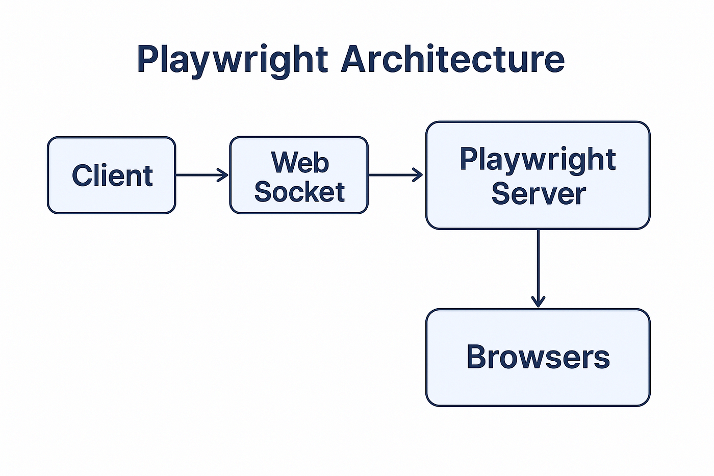

### Running Only Failed Tests (New Command)
If your test run finished and you have 3 failures out of 100, you don't need to run the whole suite again. Playwright allows you to target only those failures using the --last-failed flag.

The Command:

npx playwright test --last-failed

### Retry How it handles "Other than Expect" errors
Playwright's retry engine is triggered by unhandled exceptions. When you throw a manual error in your custom logic, Playwright catches it exactly like a failed assertion.
Summary of the FlowFailure Occurs: Your custom if condition fails and throw new Error() is executed.Playwright Intercepts: The test runner sees the error.Retry Check: Playwright looks at your retries count in the config.   Rerun: If the count is $> 0$, Playwright restarts the test from the very first step (including the Background and Before hooks).

## Write first playwright test

``` ts
test('My First Test',  async ({page}) =＞ {
    await page.goto('https://google.com');
    await expect(page).toHaveTitle('Google');
})
```
## Async and await
The keyword async before a function makes the function return a promise
The keyword await before a function makes the function wait for a promise

### is json.stringify serialization response.json is deserilization ?
Yes, your understanding is correct: JSON.stringify() is used for serialization, and response.json() performs deserialization. 

## How to record test - Test Generator
>Playwright comes with a tool - Codegen also called Test Generator.
>Record all the locators on the page

## Codegen command

>To add the url npx playwright codegen google.com

> See all options  npx playwright codegen --help

> specific browser (default:chromium) npx playwright codegen --browser firefox

> Record and save to a file  npx playwright codegen --target javascript -o record_example.js

> Set viewport - screen resolution (size)  npx playwright codegen --viewport-size=800,600

> Emulate devices  npx playwright codegen --device="iPhone 11"

> Emulate color scheme (if available) npx playwright codegen --color-scheme=dark


## What is Trace Viewer
>Trace Viewer is a GUI tool that helps viewing the executed test along with snapshots, 
timeline and other details (traces)

## How to use Trace Viewer
> Open config file and set  trace: 'on-first-retry'          
>It means - Collect trace when retrying the failed test for the 1st time only.     
>Save and Run a test to fail       
>Check trace.zip file created under test-results folder.   
>View trace - npx playwright show-trace trace.zip

 
## Trace Viewer Options
>'on-first-retry'  - Record a trace only when retrying a test for the first time.   
>'off'       - Do not record a trace.   
>'on'       - Record a trace for each test. (not recommended as it's performance heavy)     
>'retain-on-failure' - Record a trace for each test, but remove it from successful test runs

## To set trace on from command   
**npx playwright test --trace on**
>Different ways to view trace   
>Using command - **npx playwright show-trace trace.zip**    
>Using HTML Report  
>Using utility - https://trace.playwright.dev/

##  How to set Tracing programmatically
``` ts
test.only('test demo', async ({ page, context }) =＞ {
 await context.tracing.start({snapshots: true, screenshots: true})
 // test code
 await context.tracing.stop({path: 'test-trace.zip'});
});
```
## How to use before and after all tracing
``` ts
let context
let page
test.beforeAll(async ({ browser }) =＞ {
 context = await browser.newContext()
 await context.tracing.start({ screenshots: true, snapshots: true })
 page = await context.newPage()
})

test.afterAll(async () =＞ {
 await context.tracing.stop({ path: 'test-trace.zip' });
})
```
## Design Framework
https://www.testrail.com/blog/test-automation-framework-design/

## Design Pattern
https://www.geeksforgeeks.org/system-design/singleton-design-pattern/

## Software Development Life Cycle (SDLC)
>Requirement Analyis    
>Design     
>Developed      
>Testing    
>Deployment     
>Maintainance       

## Software Testing Life Cycle(STLC)
>Test Planning      
>Test Case Development      
>Test Environemnt Setup     
>Test Case Execution        
>Test Closure       

## Bug life Cycle
>New    
>Assigned   
>Open--> Reopen/Duplicate/Rejected/Deffered 
>Fixed      
>Pending Retest     
>Retest     
>Verified       
>Close      


## Types of Waits in Playwright
> Wait for an element to disappear
``` ts
await loader.waitFor({ state: 'hidden', timeout: 15000 });

await page.waitForURL(/.*dashboard/);
await page.waitForLoadState('networkidle'); 
await page.waitForResponse

expect(locator).toBeVisible()
expect(locator).toBeHidden()
expect(locator).toBeEnabled()
expect(locator).toBeChecked()
expect(locator).toHaveText('text')
expect(locator).toContainText('text')
expect(locator).toHaveValue('value')
expect(locator).toHaveAttribute('name', 'val')
expect(page).toHaveURL(/regex/)
expect(page).toHaveTitle(/regex/)
```

## Parallel Execution (Speed)

> This is the default for Playwright across different files. It runs multiple tests at the exact same time.
>Behavior: Each test gets its own worker (or shares a worker concurrently if fullyParallel is on).

## Best For: Independent tests that don't share data or state.

## Syntax: test.describe.configure({ mode: 'parallel' });

> Serial Execution (Dependency)

> In serial mode, tests in a single file are executed one after another in the same worker.

> Behavior: If one test fails, all subsequent tests in that file are skipped.

Best For: Interdependent steps (e.g., Test 1 creates a resource, Test 2 edits it, Test 3 deletes it).

## Syntax: test.describe.configure({ mode: 'serial' })

>If fullyParallel is on: Tests run in parallel (using multiple workers).

>If fullyParallel is off: Tests run sequentially in a single worker.

> If fullyParallel is OFF (Default)
>>Across Files: Playwright starts both files simultaneously. Worker 1 takes Class One, and Worker 2 takes Class Two.

>Inside the Files: * Worker 1 runs the 5 tests in Class One one after another (sequentially).

>Worker 2 runs the 4 tests in Class Two one after another (sequentially).

>If fullyParallel is ON
>Across Files: Both files start at the same time.

Inside the Files: Playwright will attempt to run all 9 tests simultaneously using up to 9 different workers (depending on your hardware and workers configuration).

## Summary: Your "classes" (files) will always run at the same time; the setting only determines if the 5 tests inside Class One wait for each other or run all at once.

## Difference between Generators and Iterators in JavaScript
https://www.geeksforgeeks.org/javascript/difference-between-generators-and-iterators-in-javascript/

### Generators
>The Generators are a special type of function in JavaScript that can be paused and resumed during their
execution. They are defined using the asterisk (*) after the function keyword. 
The Generators use the yield keyword to yield control back to the caller while preserving their
execution context.  
>The Generators are useful for creating iterators, asynchronous code, and 
handling sequences of data without loading all the data into the memory at once.

### Example: In this example, we will see a simple generator function that yields values in the sequence.
``` js
function* GFG() {
    yield 10;
    yield 20;
    yield 30;
}
const generator = GFG();
console.log(generator.next().value);
console.log(generator.next().value);
console.log(generator.next().value);

Output
10
20
30
```
### Iterators
>The Iterators are objects with a special structure in JavaScript.  
>They must have a next() method that returns an object with the value and done properties.  
>The value property represents the next value in the sequence and the done property indicates 
whether there are more values to be iterated.   
>The Iterators are commonly used for iterating 
over data structures like arrays, maps, and sets.

### Example: In this example, we will see an iterator looping through an array.
``` js
const colors = ['red', 'green', 'blue'];
const GFG = colors[Symbol.iterator]();
console.log(GFG.next());
console.log(GFG.next());
console.log(GFG.next());
console.log(GFG.next());

Output
{ value: 'red', done: false }
{ value: 'green', done: false }
{ value: 'blue', done: false }
{ value: undefined, done: true }
```

## Page Object Model
``` ts
// Page class
import { expect, type Locator, type Page } from '@playwright/test';

export class PlaywrightDevPage {
  readonly page: Page;
  readonly getStartedLink: Locator;
  readonly gettingStartedHeader: Locator;
  readonly pomLink: Locator;
  readonly tocList: Locator;

  constructor(page: Page) {
    this.page = page;
    this.getStartedLink = page.locator('a', { hasText: 'Get started' });
    this.gettingStartedHeader = page.locator('h1', { hasText: 'Installation' });
    this.pomLink = page.locator('li', {
      hasText: 'Guides',
    }).locator('a', {
      hasText: 'Page Object Model',
    });
    this.tocList = page.locator('article div.markdown ul > li > a');
  }

  async goto() {
    await this.page.goto('https://playwright.dev');
  }

  async getStarted() {
    await this.getStartedLink.first().click();
    await expect(this.gettingStartedHeader).toBeVisible();
  }

  async pageObjectModel() {
    await this.getStarted();
    await this.pomLink.click();
  }
}
```
``` ts
// test 
import { test, expect } from '@playwright/test';
import { PlaywrightDevPage } from './playwright-dev-page';

test('getting started should contain table of contents', async ({ page }) => {
  const playwrightDev = new PlaywrightDevPage(page);
  await playwrightDev.goto();
  await playwrightDev.getStarted();
  await expect(playwrightDev.tocList).toHaveText([
    `How to install Playwright`,
    `What's Installed`,
    `How to run the example test`,
    `How to open the HTML test report`,
    `Write tests using web first assertions, page fixtures and locators`,
    `Run single test, multiple tests, headed mode`,
    `Generate tests with Codegen`,
    `See a trace of your tests`
  ]);
});

test('should show Page Object Model article', async ({ page }) => {
  const playwrightDev = new PlaywrightDevPage(page);
  await playwrightDev.goto();
  await playwrightDev.pageObjectModel();
  await expect(page.locator('article')).toContainText('Page Object Model is a common pattern');
});
```
## =============================Generating==================
> 1. Genernerating locator by recoding  
> Emulate geolocation, language and timezone    
**npx playwright codegen --timezone="Europe/Rome" --geolocation="41.890221,12.492348" --lang="it-IT" bing.com/maps**
## Visual comparison
``` ts
await expect(page).toHaveScreenshot({ maxDiffPixels: 100 });
expect(await page.textContent('.hero__title')).toMatchSnapshot('hero.txt');
```
## Types of wait 
>page.waitForSelector(selector, { state: '...' }): Waits for an element to satisfy a certain state (e.g., 'attached', 'visible', 'hidden', or 'detached').      
>page.waitForURL(url): Waits for the page to navigate to a specific URL pattern.    
>page.waitForLoadState(state): Waits for the page to reach a specific load state like 'load' or 'domcontentloaded'.
>page.waitForResponse(urlOrPredicate) / page.waitForRequest(urlOrPredicate): Pauses the test until a network request or response matching the criteria is observed. 

``` ts
powershel command
$env:USER_NAME=me
$env:PASSWORD=secret
npx playwright test

batch command
set USER_NAME=me
set PASSWORD=secret
npx playwright test
```
##  Intermittent Test Failures (Flaky Tests) 
>Isolate: Determine if it’s the code, the environment (network/latency), or the test itself (race conditions).  
>Analyze Logs: Check execution screenshots, video recordings, and console logs at the exact timestamp of failure.   
>Stability Check: Run the specific test in a loop (e.g., 50 times) to see the failure rate.     
>**Fix: Avoid hard-coded waits; use dynamic waits (Wait Until Element Visible) and ensure a clean state before each test.**
##  Dev vs. QA Environment Issues
>Check Configurations: Compare environment variables, database versions, and API endpoints. Often, QA has restricted **permissions** or different data.         
> **Build Version**: Verify that the exact build/commit deployed in Dev is what reached QA.
Data Consistency: Ensure the QA database isn't corrupted or missing specific test data required for the feature.    
>**Network/Firewall**: Check if QA environment restrictions (firewalls/VPNs) are blocking specific service calls. 
##  Proceeding with an Unstable Build
>Sanity First: Run a Sanity/Smoke suite to identify if core modules (Login, Payments, etc.) are broken.     
>Stop Testing: If basic functionality fails, reject the build and inform stakeholders immediately to save time.     
>Partial Testing: If only one module is unstable, block that area and continue testing independent, stable modules.     
>Report: Provide a "Blocked" status report highlighting the specific blockers preventing full testing. 
##  Prioritizing Under Tight Deadlines 
>**Risk-Based Testing**: Focus on high-risk, high-impact features (e.g., the "Happy Path" and core business logic).     
> **Priority** P0/P1 Cases: Execute Critical (P0) and High (P1) priority test cases first; defer Low-priority UI or cosmetic bugs.      
>**Regression**: Run an automated regression suite to ensure existing features didn't break.
Communication: Flag the risks to the Project Manager—be clear about what will and will not be tested.

##  Critical Prod Bug Reported by Client
>**Reproduce**: Immediately try to replicate the bug in the Staging/QA environment using the client's steps.        
>**Triage**: Assess the impact. If it's a "showstopper," it needs a Hotfix.     
>**Root Cause (RCA)**: Once fixed, perform a Root Cause Analysis. Why was this missed? (Missing test case? Environment difference?)     
>**Update Suite**: Add a new test case to the regression suite to ensure this specific bug never happens again. 

## Requirement, Test Case & Test Execution Scenarios
* **Unclear Requirement/BA Unavailable**: 
>- I would check the Confluence/Documentation history, 
look at existing UI/Code, or ask the Dev Lead. If still unclear, I’d document my assumptions, 
send an email to the BA for later confirmation, and proceed with the most logical path to avoid a total 
block

* **Blocker on first Test Case**: 
>- I would **immediately report the blocker to the Dev team**. While waiting, 
I’d **try to bypass the blocker** (e.g., using a direct URL or DB injection) to test other modules. 
**If everything is blocked**, I would **notify the Lead and switch to updating documentation or automation scripts.**

* **Expected Result is wrong in Requirement**: 
>- I would **verify with the Dev team and BA**. 
If they agree it's a documentation error, I'd **request a Requirement Change Request(CR)**. 
I would not pass the test based on "verbal" logic; the **documentation must be updated first**.

* **Bug not reproducible in UAT**: 
>- I would ask for the exact environment details (browser, version, user data). 
I’d record a video of me reproducing it or offer a screen-share session with the dev to show them the bug 
live.

**Smoke testing fails on new build:** 
>- I would reject the build immediately. Smoke testing is the entry 
criteria; if it fails, the build is not stable enough for functional testing. 
I’d inform the Dev Lead and stakeholders.

**100 TCs, 3 hours left:** 
>- I would use Risk-Based Testing. I’d prioritize P1 (Critical/High) test cases, 
focus on "Happy Path" scenarios, and cover the most recently changed code.
I’d inform the Lead that P2/P3 cases will remain pending.

**Release today vs. High-Severity Bug:** 
>- I would provide a detailed Risk Assessment.
I’d highlight what could go wrong if we release. The final "Go/No-Go" decision lies with the Product Owner,
>- but as QA, I must advocate for the user and recommend a delay or a hotfix.

**Prod Defect RCA:** 
>- I’d check P**roduction Logs**, verify if it was a "**Missing Requirement**" or a "**Test Miss"**,
" and see if it was environment-specific. I’d then update the regression suite to ensure it never happens again.
>- Works on my system, fails on theirs: I’d compare browser versions, cache, screen resolution, and 
user permissions. Often, it’s a "dirty" cache or a different user role causing the discrepancy.

**Last-minute Requirement Change:**
>- I’d perform an Impact Analysis. I’d identify which existing TCs are now 
invalid, update them, and communicate to the team if the original delivery date needs to shift due to 
the rework.

**Defects, Communication & Validation Scenarios**
>- Dev rejects a bug: I’d re-verify the requirement. If I'm right, I’d **provide screenshots, logs, and a video**. 
>- If the dev **still disagrees**, I’d **bring it to the Bug Triage meeting for a collective decision**.

**Bug leaked to production:** 
>- I would stay calm, help **reproduce it**, and **perform an RCA**. I’d identify 
**why the test case was missed and add it to the regression suite immediately to prevent recurrence**.

**Login takes too long:** 
>- This is a Performance/Usability bug. I’d measure the actual time using Network tab
(Chrome DevTools) and compare it against the NFR (Non-Functional Requirements) or industry standards
(usually < 3 seconds).

>- API partial data/UI stuck: I’d check the API response in the Network tab. If the JSON is incomplete, 
it’s a Backend bug. If the JSON is full but the UI is blank, it’s a Frontend bug.

** Related Bugs:**
>- I would report them separately if they have different root causes. If they all item from 
one single error, I'd report one main bug and list the impacted areas to avoid duplicates.

>- System slow, no steps: I’d use Monitoring tools (like New Relic or Dynatrace) or check server logs during 
>- the slowness. I’d also look for patterns (e.g., does it happen only when the DB has large records?).

**Dependent module not ready:**
>- I would use Stubbing or Mocking. I’d simulate the missing module’s response (using tools like Mockito or Postman Mocks) to continue testing my module.

**Inconsistent Bug:** 
>- I’d report it as "Intermittent" and include as much detail as possible (logs, timestamps, system load). 
>- I’d try to find a pattern (e.g., happens only after 10 consecutive clicks).

"Working on my machine": I’d check his Config files, DB version, and Environment variables. Usually, developers have "cleaner" data or higher permissions than the QA environment.

**Negative scenarios for a form: **
>- I’d use Boundary Value Analysis and Equivalence Partitioning. I’d test empty fields, special characters, exceeding character limits, and incorrect data types.

**UI, Data, Compatibility & Edge Cases**
>- Chrome vs. Safari failure: I’d check for CSS/JavaScript compatibility issues. Some JS functions or CSS 
properties (like certain flexbox behaviors) aren't supported equally across engines (V8 vs. WebKit).

**No real payment card:**
>- I’d use Test Cards provided by the gateway (Stripe/Paypal). If those aren't available, I’d ask Devs to "Mock" a successful/failed transaction response in the sandbox environment.

>- 100MB File Upload: I’d test Timeout limits, Progress bar accuracy, and Server-side validation (does it reject 101MB?). I’d also check if the system remains responsive during the upload.

>- Unstable SMS/OTP: I’d check the DB/Logs to see if the OTP was generated. If the SMS gateway is down, 
I’d request the dev to temporarily redirect the OTP to a console log or a mock email.

>- Search results change: I’d check if the search is based on dynamic algorithms 
(like "Trending" or "Price Fluctuations"). If it’s supposed to be static, 
I’d check the SQL query for inconsistent sorting (ORDER BY).

>- 10K records vs 2K load: I’d check for Pagination or Lazy Loading issues. 
I’d also verify if there is a hard-coded "Limit" in the API query or a timeout on the frontend.

>- Calculator/No requirements: I’d use Ad-hoc testing and compare it against standard calculators 
(like Windows/iOS). I’d focus on edge cases: dividing by zero, very large numbers, and decimal precision.

>- Peak traffic bug: I’d use Load Testing tools (JMeter/LoadRunner) to simulate high traffic in a 
performance environment and capture the logs/memory leaks during the spike.

>- UI Alignment on resolutions: I’d use Chrome DevTools Emulation or tools like BrowserStack.
I’d look for "Hardcoded pixel values" in the CSS instead of responsive percentages.

>- No Log Access: I’d ask the DevOps/Admin for "Read-only" access or request a Log Aggregator 
(like Splunk/ELK). If all fails, I’d ask a developer to share the specific log snippet for a timestamp.


## what are the waitForLoadState check on backend ?
``` ts
await page.waitForLoadState('load');
await page.waitForLoadState('domcontentloaded');
await page.waitForLoadState('networkidle');


page.waitForTimeout(): Pauses execution for a specified amount of time
page.waitForEvent(): Waits for a specific event to be emitted
page.waitForFunction(): Waits until a custom JavaScript function evaluates to a true
page.waitForResponse(): Waits for a specific network response
const submitbtn = await page.locator('#form-submit');

await submitbtn.waitFor({ state: 'visible' });

page.waitForFunction(): Waits for a custom JavaScript function to evaluate to true.
page.evaluate(): page.evaluate() can be used to evaluate any custom JavaScript with a wait mechanism. This helps in handling complex scenarios.
locator.waitFor(): locator.waitFor() functions allow parameters like visible, hidden, enabled, or disabled, this enables to conditionally check for specific element state.
```

## Retry a Specific Test or Group 
If only certain tests are flaky, you can set retries specifically for them using test.describe.configure or within the test definition SKPTRICKS. 
•	For a specific test:
typescript
``` ts
test('flaky test', async ({ page }) => {
  // test steps
}, { retries: 3 });

```

### 1. What is Playwright?
Playwright is an open-source testing tool, which supports functional, API, and component testing. The playwright is managed by Microsoft.
2. What is the difference between Selenium and Playwright?
The playwright is ready to use a framework one can install and start using.	Selenium Provides API/Libraries you need to build the framework
Playwright shipped with in-built assertion libraries	Selenium doesn't provide any assertions, we need to integrate using JUnit or TestNG
The playwright uses the WebSocket connection to communicate with the browser	Selenium uses the Webdriver API/HTTP to communicate with the browser
The playwright is faster compared to Selenium	Selenium comparatively slower
The playwright doesn't support the safari stock browser rather it uses the open-source, Webkit browser to test safari	Selenium supports Safari
Playwright officially supports Java, Python, .NET C#, TypeScript, and JavaScript.         	Selenium officially supports Java, Python, C#, Ruby, Perl, PHP, and JavaScript

##  Playwright Request Flow: Open URL & Click Button


🧑‍💻 Client
The user (via test script in Node.js, Python, Java, etc.) writes:

await page.goto("https://example.com"); 
await page.click("button#login");
🔌 WebSocket Connection
The request is sent over a WebSocket to the Playwright Server.
Playwright Server (Node.js)
The server receives the command and:

Parses it

Translates it into browser-native instructions
(for Chromium, this means CDP+, which includes CDP commands + Playwright enhancements)
Browsers (Chromium / Firefox / WebKit)
The browser executes the instructions:

Navigates to the given URL

Renders the page and waits for readiness

Locates the selector (button#login)
Feedback Loop (Browser → Playwright Server → Client)

Once the browser completes the action, it sends response data and status events (like “navigation complete”, “click dispatched”, “error occurred”, etc.).

In Chromium, this feedback uses CDP/CDP+ (e.g., Page.loadEventFired, Runtime.consoleAPICalled).

These events are captured by the Playwright Server, which serializes and sends them back via the WebSocket to the Client.

### 3.What are the advantages of a Playwright?
Compared to any other framework Playwright has a lot of advantages, as it is a modern solution it's built on top of the limitation of another framework
•	The playwright is easy to install and learn
•	Playwright supports Java, Python, .NET C#, TypeScript, and JavaScript.
•	It supports both API and end-to-end testing
•	Playwright supports Chromium-based browsers, Firefox, Safari(Webkit)
•	As Playwright doesn't use the webdriver API the execution is comparatively faster
•	Playwright automatically waits before making any actions where a user doesn't have to provide implicit or explicit waits
•	Playwright allows Network traffic control. Mocks etc.
•	Edge case scenarios like File upload and download can be handled easily in playwright
4. Name some disadvantages of Playwright.
•  Playwright doesn't support Mobile automation (They might introduce it in the future)
•  Playwright doesn't support legacy IE Automation
•  Playwright doesn’t support Safari stock browser
•  Some of the build tools like Teamcity is not directly support
•  Some of the features like Ordering, Priority, and Dependancy tests which are available in TestNG are not available in Playwright yet.
### 5. What are the different testing types the Playwright supports?
Playwright supports functional testing,  API testing, and Component level testing.
### 6. What are the programming languages that the playwright supports
Playwright supports Java, Python, .NET C#, TypeScript, and JavaScript. However, the Typescript/Javascript version of Playwright is more stable and most used.
### 7. Briefly describe the commands that are used for Playwright installation and Execution of tests
As Playwright supports many programming languages each programming language follows its own installation process.
In this context we are using the Playwright and Javascript we need to use the following commands
Before installation, we need to ensure that NodeJS binaries are installed in our machine and then we can use
*npm init playwright@latest*
The above command will install the required packages and configurations. Once done we are ready to write the test cases.
*npx playwright test*
The command is used for executing playwright tests. By default, the playwright executes all the tests that are available for the project.
### 8. What is a Configuration File in Playwright explain?
As the name indicates the configuration file is the place where we configure the execution behavior of the playwright. The configuration file is typically named playwright.config.ts(/js).
Using the configuration file we can configure headless mode, fullscreen, screenshot options, baseURL, browser options, etc.
### 9. What is @playwright/test package in Playwright?
The Playwright can be used with different test runners such as Mocha, Jasmine, Jest, etc. Similar way playwright has its own test runner called the playwright test. The playwright test is the default test runner for the playwright.
### 10. What is Page class in Playwright?
The Page class in playwright is the main class, which provides the methods to interact with the browser. It also provides a set of event handlers that helps to execute a set of actions as soon as the event triggers.
11. How to navigate to specific URLs in Playwright explain with sample tests
``` ts
const { test, expect } = require("@playwright/test");
test.describe("navigation", () => {
  test("navigation", async ({ page }) => {
    await page.goto("https://playwright.dev/");
  });
});
```
The page.goto() is used for navigating to a specific URL.
The test.describe() hook is used for grouping the set of tests
The test() contains actual tests with playwright commands.
### 12. What are the different types of reporters that the playwright supports?
The playwright supports different types of reports
•	Dot reporter
•	Line reporter
•	HTML reporter
•	JSON reporter
•	JUnit reporter
•	Custom reporter
In addition to the above playwright also supports allure reporters using third-party plugins.
### 13. What are the locators in the Playwright list of any five
Locators help to find the elements on the page uniquely at any point in time.
The page class provides the locator function.
•	page.getByText() : Find the element that matches the given text
•	page.getByRole(): Find the element that matches the role attribute
•	page.getByLabel(): Find the element that matches the label
•	page.getByTestId(): Find the element that matches the data-testid attribute
•	page.getByTitle(): Find the element that matches the title attribute
•	page.locator(<css> or <xpath>): Find the element by using the CSS or XPath_
### 14. What are the different types of text selectors available in Playwright?
Text-based locators in Playwright are a unique feature, that helps to locate the element which is having specific text
locator.(<some_text) : Matches the element that has passed text
 Ex: await page.locator('text=Home menu')
:text-is(): this can be used inside the CSS selector, which will perform the exact match before finding the elements
Ex: await page.locator('#nav-bar :text-is("Home")')
:has-text(): This is another pseudo-class, which matches the element which contains the passed text.
Example: await page.locator(':has-text("Playwright")')
### 15. How to use assertions in Playwright? List any 5
Playwright Test uses the jest expect library for assertions.
The Playwright supports soft and hard assertions both.
There are many assertions which expect library provides some of them are
expect(value1).toBe(value2): This helps to compare two values. Like equals of two strings etc.
expect(<Boolean_value1).toBeTruthy(): Assert two boolean values to be true.
expect(locator).toBeVisible(): Ensured specified locator is Visible on DOM
expect(locator).toContainText(expected_text): Ensures the specific DOM element contains the given text
expect(locator).toHaveClass(expected_class): Ensures the locator has specified css class
expect(locator).toHaveCount(count): Ensures the given locator count in dom should be equal to "count"
expect(page).toHaveTitle(title): Verifies the page title is the same as expected
### 16. What are soft assertions in Playwright?
By default when the assertions fail the test terminates, but if we use the soft assertions do not terminate the execution, but the test will be marked as failed at the end.
The Playwright provides a command
expect.soft() for soft assertions
Example:
expect.soft(page.locator('#title').toHaveText('Udemy')
### 17. How to negate the Matchers/Assertions in Playwright? Or How can I verify not conditions in Playwright?
The Negation matchers are most commonly used in Playwright.
The .not can be used in Playwright to Negate the assertions
For example, if we have to verify the a should not equal 10 then we can use
expect(a)not.toBe(10)
The not is generic keyword can be used with any assertions to negate the condition.

### What are command line options in the Playwright? Explain 5 helpful options
The configuration file contains the same set of run time configurations, the command line options also provide the run time configurations. When the same option is used in both places the command line options take priority.
20. Some of the Important command line options
•	Run all the tests
npx playwright test
•	Run a single test file
npx playwright test tests/todo-single.spec.ts
•	Run multiple tests
•	npx playwright test tests/todo-page/ tests/landing-page/
•	Run tests in headed mode
npx playwright test --headed
•	Run tests on Specific browser
npx playwright test --browser "chromium"
•	Retry failed test
•	npx playwright test --retries 2
21. What is headed and headless mode in Playwright
•	The headed mode browser is just like any other browser. For example, if you open a chrome browser opens you can see it visually and perform the action on it.
•	The headless browser execution happens in the background, the actions and browsers are cannot be seen. The headless browser execution is faster than the headed mode.
### Does Playwright support HTML reporters? How to Generate HTML reports in Playwright?  
Playwright supports default HTML reporter. You can generate the HTML reporters using the below command.
npx playwright test --reporter=html

23. What are timeouts in Playwright? What are the different types of Timeouts available in Playwright?
Timeout ensures that before marking test execution as a failure the amount of time the Playwright needs to wait.
In Playwright timeouts can be set at different levels
Test timeout: This is applicable for test and fixture execution time.
Expect timeout: Timeout for assertions
Action timeout: Timeout for each action
Navigation timeout: Timeout application for Navigation actions such as page.goto() etc.
Global timeout: Global Timeout for the whole test run
beforeAll/afterAll timeout: Timeout applicable for beforeAll/afterAll hooks
Fixture timeout: This timeout is set to individual fixtures.

### How to navigate forward and backward in Playwright?
The playwright provides specific commands to navigate backward and forward.
*page.goForward()* command can be used to navigate forward from the browser history
*page.goBack()* command can be used to navigate backward from the browser history


26. Does playwright support the safari browser if so can we execute the test on safari?
Unlike selenium, Playwright doesn't support the Native safari browser. The Playwright supports the open-source version of Safari which is a Webkit browser.
You can execute the tests on the Safari Webkit browser using the configurations in the config file below:
const config = {
  use: {
    channel: 'chrome',
  },
};
By specifying in the command line parameter
npx playwright test --browser "webkit"
27. How to wait for a specific element in Playwright?
The playwright has an auto-waiting mechanism that reduces the usage of explicit waits in the test. However, in some scenarios, we might need to wait for specific elements in that case we can use the .waitFor()
Example:
const someElement = page.locator('#myElement);
await someElement.waitFor();
By default waitFor() waits for the element to be visible, however, the behavior can be changed to waitFor attached, detached, hidden
Example: await someElement.waitFor({ state: 'attached' })

### What is browser context?
Browser context provides a way to operate multiple independent browser sessions. The browser class provides newContext() method which helps to create a new browser context.
Example:
const contxt = browser.newContext()

### How to open multiple windows in Playwright?
The playwright provides a way to open multiple windows. In Playwright each window is called Pages.
You can create multiple pages like below
const pageOne = await context.newPage();
const pageTwo = await context.newPage();

### How to handle iFrame in PLaywright?
The frameLocator() gets the frame on a particular page in Playwright. Using frameLocator() we can perform various actions on the iFrame
Example:
const button = await page.frameLocator('#my_ifr').locator('#button_my)

### Explain some of the click and double click actions with its options.
click(): action is used for clicking any element on the page.
dblclick: The dblclick() is used to perform the double click on the element.
Both of the above click takes multiple parameters for example:
force: PLaywright waits for actionability it internally checks for if the element is ready to click. The force option helps bypass this option
locator.click({force:true});
position: Position can be used to perform the coordinates with respect to the element.
delay: can be used for time between mouseup and mousedown

### How to perform a right-click on Playwright?
The playwright doesn't have a separate command for right click, in order to right click we need to use the click action with the button parameter
Example:
*locator.click({button:right})*

### How to evaluate Javascript in Playwright?
The playwright provides page.evaluate() function, which can be used for evaluating any javascript function.
Example:
const href = await page.evaluate(() => document.location.href);

### What are Playwright fixtures?
Test fixtures are used to establish an environment for each test. Some of the pre-defined fixtures are page, context, browser, browserName. The fixture is isolated for each test.
Consider you have multiple tests like below
test('basic test', async ({ page }) => {
  await page.goto('https://playwright.dev/');
});
test('basic click, async ({ page }) => {
  await page.locator('#logo').click();
});

Though you expect the above test to be executed one after the other, the test runs and fails. As the page fixture is isolated.
You can override the default fixtures like below.
For example, the above test can be rewritten to execute correctly
let todoPage;
test.beforeEach(async ({ page }) => {
    todoPage = new TodoPage(page);
  });
test('basic test', async () => {
  await todoPage.goto('https://playwright.dev/');
});
test('basic click, async () => {
  await todoPage.locator('#logo').click();
});
You can notice that the todoPage is shared between tests.

### What is CodeGen in Playwright?
Playwright codeGen is similar to the selenium test recorder, the CodeGen is a tool that comes with playwright you can use it for recording the Playwright tests.

### How to parameterize tests in Playwright?
Parameterize helps to run the same tests with multiple values, some times it is also called as data-driven testing. Playwright allows parameterization, you can use data from either csv, json or plain arrays. To implement parameterization you need to use for or foreach loop.
Example:
       const fruits = ['Banana', 'Orange','Apple'];
       for (const name of fruits) {
         test(`testing with ${name}`, async () => {
             //your code
         });
       }

### Write a code to upload the file
•	The playwright provides a special command to upload a single file or multiple files. The command setInputFile() or setInputFiles() is used for uploading the file in Playwright.
•	Example:
•	Upload single file:
await page.getByLabel('Upload file ').setInputFiles('myfile.pdf');
•	Upload multiple files:
await page.getByLabel('Upload files').setInputFiles(['file1.pdf', 'file2.pdf']);
•	Note: Passing empty array to setInputFiles() makes unselect the files if you are already selected.
•	Example:
await page.getByLabel('Upload file').setInputFiles([]);
38. Write a code to download the file
•	The upload and download files are edge case scenarios, Playwright has dedicated commands for both. The download files can be performed in the playwright using the waitForEvent() in the playwright.
•	Example:
const [ download ] = await Promise.all([
  page.waitForEvent('download'),
  // Perform the action that initiates download
  page.locator('button#delayed-download').click(),
]);
•	Once the download is complete you can get the downloaded path using the command
const downloadedPath = await download.path();
39. How to perform drag and drop in Playwright?
•	Drag and drop can be performed using multiple ways
•	Using dragTo() command
•	Manually specifying mouse actions
Using dragTo() function for drag and drop
You need to pass the target position locator to dragTo function
Example:
await page.locator('#item-to-be-dragged').dragTo(page.locator('#item-to-drop-at'));
       The above dragTo() function internally does
•	Hovers on the item to be dragged
•	Clicks on the item to be dragged
•	Move the mouse to target location
•	Rleases the left mouse button
As mentioned earlier, you can use the manual method, by perfoming all the above actions instead of dragTo() function.
Manual way to drag and drop
await page.locator('#item-to-be-dragged').hover();
await page.mouse.down();
await page.locator('#item-to-drop-at').hover();
await page.mouse.up();
40. How to handle browser popups or dialogs?
•	Dialog popups are native to the browser or operating systems. The dialogs need special mechanism to handle as you cannot inspect the locator for these pop-ups.
•	There are different types of pop ups such as alert(), confirm(), prompt()
•	Handling Alert
•	//Click on Ok
page.on('dialog', dialog => dialog.accept());
•	Handling confirm
•	//Click on Ok
page.on('dialog', dialog => dialog.accept());
//Click on Cancel
page.on('dialog', dialog => dialog.dismiss ());
•	Handling Prompt
•	//Type the text, RSAcademy and Accept the pop up
page.on('dialog', dialog => dialog.accept("RSAcademy"));
41. What is testInfo Object?
testInfo object contains information about tests that are currently running such as duration, errors, project, status,  etc. Using the testInfo object we can control the test execution.
42. What is testError Object?
The testError object in PLaywright contains information about errors thrown during the test execution such as error message, stack, and value.
43. What is global setup and tear down explain?
•	The global setup is one-time setup that is needed for test execution. The global setup is executed before starting any tests. For example, if you want to set up some files, and URLs you can utilize this function.
•	Similarly, the global teardown is a one-time teardown option provided by Playwright. The global teardown will be executed after all the tests are executed. This will be helpful to generate custom reports, sending emails, freeing up resources, etc.
•	Example Global Set up
// global-setup.js
module.exports = async config => {
  const {storageState } = config.projects[0].use;
};
// playwright.config.js
const config = {
  globalSetup: require.resolve('./global-setup'),
  use: {
    storageState: 'state.json',
  },
};
module.exports = config;
•	Example Global Teardown
// global-teardown.js
module.exports = async config => {
 //Some code
};
// playwright.config.js
const config = {
  globalTeardown: require.resolve('./global-teardown),
  use: {
    storageState: 'state.json',
  },
};
 module.exports = config;

44. How to capture Network logs in Playwright?
The playwright provides a way to monitor browser network logs. You can capture all the request and response network logs and their status. Using the listener
page.on('request', request =>
      console.log('>>', request.method(), request.url()));
  page.on('response', response =>
      console.log('<<', response.status(), response.url()));
  await page.goto('https://example.com');
45. How to capture screenshots in PLaywright?
•	The Playwright allows taking the screenshot. the page.screenshot() function is provided by Playwright to the screenshot. You can place the screenshot() command anywhere in the code to save the screenshot.
•	Take the full page screenshot
await page.screenshot({ path: 'screenshot.png', fullPage: true });
•	Take the Element level screenshot
await page.locator('.header').screenshot({ path: 'screenshot.png' });
46. Does Playwright support API testing? If so how can we perform API testing?
Yes, Playwright supports API Testing. We can perform any HTTP API method calls such as GET, POST etc. using the playwright and validate the status and responses.
Example:
test("Get users", async ({ request, baseURL }) => {
  const apiResponse = await request.get(`${baseURL}public/v2/users/`);
  expect(apiResponse.ok()).toBeTruthy();
  expect(apiResponse.status()).toBe(200);
});
47. What is Visual Testing? Why do we need it?
•	Visual Testing is also known as visual comparisons, where two screenshots will be compared. The first screenshot is called the reference or base image, the subsequent run will compare the recent screenshot with reference images and produce the results.
•	Visual comparison testing is helpful for UI testing. Using functional testing we will not be able to validate the fonts, styles, typography, alignment, etc. but using the visual comparison we can validate everything related to the application User interface.
48. Write a simple code to Test Visually
For example, if we need to compare the home page we need to write the below code in Playwright.
test('Visual test homepage', async ({ page }) => {
  await page.goto('https://playwright.dev');
  await expect(page).toHaveScreenshot();
});
•	During the first run, the playwright stores the reference image of the homepage, and the next run will be compared against the reference image.
•	Optionally we can pass the pixel differences if we need to ignore the minor differences in the image.
test('example test', async ({ page }) => {
  await page.goto('https://playwright.dev');
  await expect(page).toHaveScreenshot({ maxDiffPixels: 100 });
});
49. How to configure multiple reporters in Playwright?
The playwright allows configuring multiple reporters. The reporter option is available on the playwright.config.js, you can specify the reporter types to configure multiple reporters.
Example:
// playwright.config.js
const config = {
  reporter: [
    ['list'],
    ['line'],
    ['json', {  outputFile: 'test-results.json' }]
  ],
};
module.exports = config;
50. What is the serial mode in Playwright?
In some scenarios, tests may be inter dependent. The second test might need the output of the first one. Running tests parallelly in such cases will create the test cases to fail and it's like a false failure. The serial mode allows running the tests serially one after the another. If one test fails all remaining tests are skipped and can be retried as a group again.
Example:
test.describe.configure({ mode: 'serial' });
let page;
test.beforeAll(async ({ browser }) => {
  page = await browser.newPage();
});
test.afterAll(async () => {
  await page.close();
});
test('runs first', async () => {
  await page.goto('https://playwright.dev/');
});
test('runs second', async () => {
  await page.getByText('Get Started').click();
});
51. How to perform parallel execution in PLaywright?
•	The playwright supports parallel execution. Parallel execution can be achieved at the global level or test level in the playwright.
•	Parallel in test file level
•	The mode: 'parallel' can be passed to describe.configure() function to achieve parallelism.
Example:
test.describe.configure({ mode: 'parallel' });
test('runs in parallel 1', async ({ page }) => { /* ... */ });
test('runs in parallel 2', async ({ page }) => { /* ... */ });
•	Parallel option in the playwright config file
•	We can mention the fullyParallel option in the configuration file, this makes the tests run parallelly to all tests.
//playwright.config.js
const config = {
  fullyParallel: true,
};
module.exports = config;
52. How to perform mobile device emulation in Playwright?
•	The emulation features allow testing the application in mobile mode or tablet mode by changing the properties of the browser such as screensize, useragent, geolocation etc.
•	For example, if we need to test the mobile safari we can specify the option in the playwright config file like below.
const config = {
  projects: [
    {
      name: 'Mobile Safari',
      use: {
        ...devices['iPhone 12'],
      },
    },
  ],
};
module.exports = config;
•	Similarly, we can set the viewport to match the mobile or tablet screen size
const config = {
  use: {
    viewport: { width: 580, height: 720 },
  },
};
module.exports = config;
53. Mention some of the helpful ways to debug Playwright tests.
•	The playwright provides multiple ways to debug.
•	Using the debug option in the command line.
npx playwright test --debug
•	Debug single test
npx playwright test example.spec.ts --debug
VSCode extension
•	Apart from the command line debugging option Playwright also provides the VSCode extension "Playwright Test for VSCode"
•	Trace on option
•	You can also force the Playwright to record the trace by passing the --trace on option.
•	Example:
npx playwright test --trace on
Pause option
page.pause() can also be used inside the test script to pause the test and do some debugging.

55. Mention some of the advantages of Playwright compared to Cypress
•  The Cypress and Playwright share a lot of similarities and Playwright overcomes a lot of limitations that cypress has
•  The playwright supports iFrame, Cypress doesn’t
•  Playwright supports multiple windows/tabs, Cypress doesn't
•  A playwright can test the cross-domain URLs whereas Cypress doesn't support
•  Playwright supports Safari Webkit browser Cypress doesn't support Safari
•  Playwright supports multiple languages such as Java, Javascript, Python, and C#, the Cypress supports only Javascript/Typescript

54. What is actionability in Playwright? Explain in detail
•	Playwright architecture has a special type of checks before performing any actions on elements. The checks are called actionability checks.
•	For example when you do click operation page.click()
•	It will perform many checks internally such as
•	Element is attached to DOM
•	Element is Visible
•	Element is Stable and animation is completed(if any)
•	Element is ready to receive the events
•	Element is enabled.
This mechanism is also called automatic waiting in the Playwright. Since the Playwright performs all the above checks by default one is no need to perform the above checks manually.
